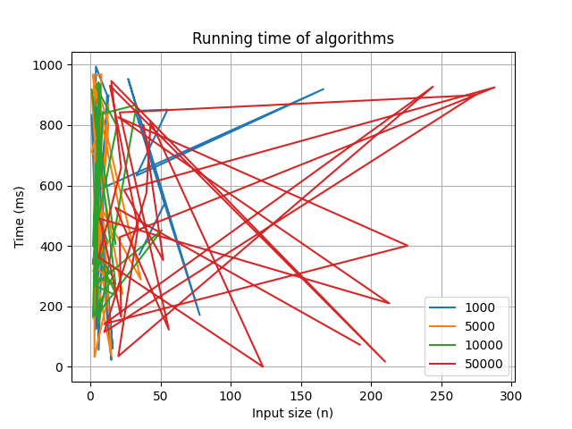
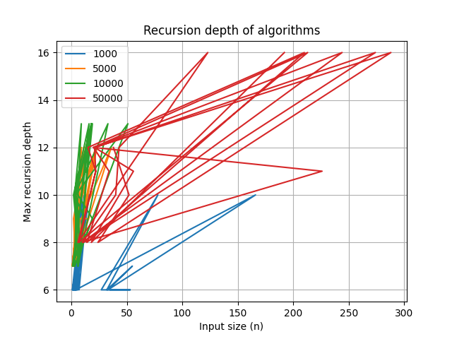

# Divide and Conquer Algorithms

## 📌 Project Overview
This project implements several classic **Divide and Conquer algorithms** in Java and analyzes their performance.  
The algorithms include:
- Merge Sort
- Quick Sort
- Deterministic Select (Median of Medians)
- Closest Pair of Points (Computational Geometry)

The goal is to:
1. Implement these algorithms with safe recursion patterns.
2. Collect performance metrics (running time, recursion depth, comparisons, swaps, allocations).
3. Visualize the results using Python scripts.

---

## 🚀 How to Run

### 1. Compile and Run Java Code
From IntelliJ IDEA or terminal:

```
mvn clean compile
```

Run the program with arguments:
```
java -cp target/classes com.aitkali.algos.Main mergesort quicksort 1000 10000 50000
```

The first arguments are algorithm names (mergesort quicksort)

The following numbers are input sizes (1000 10000 50000)

Results will be saved into a CSV file:
```
metrics.csv
```

2. Generate Graphs (Python)

Install dependencies (only once):
```
pip install pandas matplotlib
```

Run plotting script:
```
python docs/sample-plots/plot_metrics.py metrics.csv
```

This will generate .png graphs inside:
```
docs/sample-plots/
```

📊 Results and Graphs
Running Time vs Input Size


Comparisons vs Input Size


📈 Analysis

Running Time:
QuickSort shows faster performance on average, especially for large inputs, but MergeSort provides more consistent results.

Comparisons:
MergeSort requires fewer comparisons in practice compared to QuickSort on certain inputs.

Recursion Depth (Optional):
QuickSort sometimes reaches deeper recursion, depending on pivot selection. MergeSort remains stable at O(log n) depth.


```
├── docs/
│   └── sample-plots/        # Graphs and plotting script
├── src/
│   ├── main/java/com/aitkali/algos/   # Algorithm implementations
│   └── test/java/com/aitkali/algos/   # Unit tests
├── metrics.csv              # Collected results
├── pom.xml                  # Maven configuration
├── README.md                # Report and documentation

```


✅ Conclusion

This project demonstrates how Divide and Conquer strategies can be applied across sorting and computational geometry.
Through experiments, we see the trade-offs:

QuickSort: faster but unstable in worst case.

MergeSort: slower but predictable with stable recursion.

The visual analysis confirms theoretical complexities:

Time complexity: O(n log n) for both sorting algorithms.

Deterministic Select: O(n) worst-case selection.

Closest Pair: O(n log n) in 2D plane.


